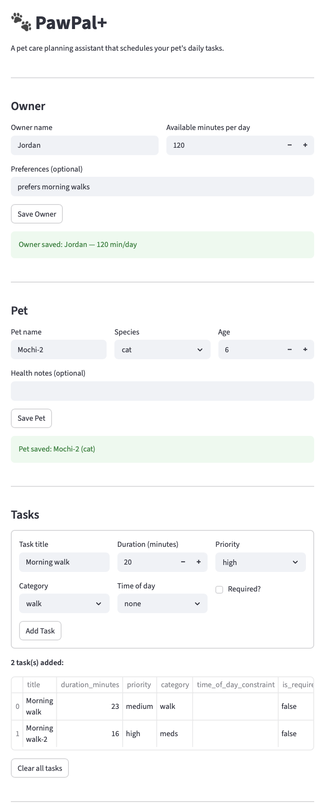
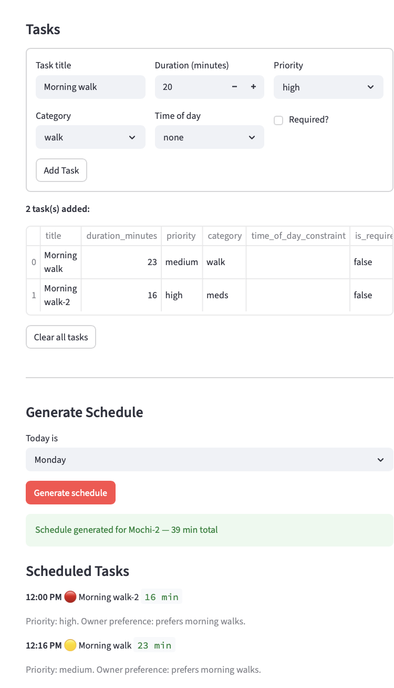

# PawPal+ (Module 2 Project)

**PawPal+** is a Streamlit-based pet care planning assistant that helps owners schedule daily tasks for their pets based on priority, available time, and time-of-day preferences. It generates an explained daily plan, detects scheduling conflicts, and automatically queues recurring tasks for the next day.

---

## Features

### Scheduling
- **Priority-based scheduling** — Required tasks are always placed first, followed by high → medium → low priority tasks within each group.
- **Time slot assignment** — Tasks are assigned to morning (8:00 AM), midday (12:00 PM), or evening (6:00 PM) slots with independent cursors, preventing overlap within each window.
- **Available time enforcement** — The scheduler tracks remaining minutes and skips any task that would exceed the owner's daily budget, logging it to a "Skipped" list.
- **Weekly task gating** — Tasks with `frequency="weekly"` only appear on their designated `repeat_on` day, keeping daily plans clean on off-days.

### Algorithms
- **Chronological sorting** — `sort_by_time()` reorders any scheduled task list by actual start time using `datetime` parsing, regardless of input order.
- **Conflict detection** — `detect_conflicts()` scans one or more pets' plans for overlapping time windows within each slot and returns plain-language warnings without crashing the app.
- **Daily & weekly recurrence** — When a task is marked complete, `next_occurrence()` generates a new task due the next day (daily) or in 7 days (weekly) using Python's `timedelta`.

### Filtering & Status
- **Status filtering** — `pending()` and `completed_tasks()` let you query what's left or done in a plan at any point during the day.
- **Pet-based filtering** — `filter_by_pet()` isolates scheduled tasks by pet name, designed for multi-pet households.

### Data Integrity
- **Task validation** — `Task.__post_init__()` raises a `ValueError` immediately on invalid priority, catching bad data at construction time rather than at runtime.
- **Owner-linked availability** — `Scheduler` reads available minutes directly from `pet.owner`, ensuring the schedule always reflects the owner's actual constraints.

---

## Project structure

```
pawpal_system.py   — Core classes: Owner, Pet, Task, ScheduledTask, DailyPlan, Scheduler
app.py             — Streamlit UI
main.py            — Terminal demo script
test_pawpal.py     — Pytest suite (12 tests)
uml_final.md       — Final Mermaid.js class diagram
reflection.md      — Design and implementation reflection
```

---

## Smarter Scheduling

The scheduler goes beyond a simple task list with four algorithmic improvements:

- **Chronological sorting** — `Scheduler.sort_by_time()` reorders any task list by actual start time using `datetime` parsing, so output always reads top-to-bottom regardless of input order.
- **Status and pet filtering** — `DailyPlan.pending()` and `DailyPlan.completed_tasks()` let you query what's left or done. `Scheduler.filter_by_pet()` isolates tasks by pet name for multi-pet households.
- **Recurring task auto-scheduling** — When `Scheduler.mark_task_complete()` is called, it automatically creates the next occurrence via `Task.next_occurrence()`, advancing `due_date` by 1 day (daily) or 7 days (weekly) using `timedelta`.
- **Conflict detection** — `Scheduler.detect_conflicts()` scans one or more pets' plans for overlapping time windows within each slot (morning / midday / evening) and returns human-readable warnings without crashing the program.

## Testing PawPal+

### Run the tests

```bash
python -m pytest test_pawpal.py -v
```

### What the tests cover

| Category | Tests |
|---|---|
| **Task status** | `mark_complete()` flips `completed` to `True`; adding tasks increases pet task count |
| **Sorting** | Tasks added out of order are returned chronologically; single-task and empty-list edge cases handled without error |
| **Recurrence** | Daily task produces a next occurrence due tomorrow; weekly task due in 7 days; month/year rollover (e.g. March 31 → April 1) works correctly |
| **Auto-scheduling** | `Scheduler.mark_task_complete()` appends the next occurrence to `pet.tasks` with `completed=False` |
| **Conflict detection** | Overlapping tasks in the same slot produce a warning; tasks in different slots do not; exact same start time is flagged |

### Confidence Level

⭐⭐⭐⭐ (4/5)

The core scheduling logic — priority ordering, time slot assignment, recurrence, and conflict detection — is well covered by 12 passing tests including edge cases like month rollover and identical start times. One star is held back because the Streamlit UI layer (`app.py`) has no automated tests; session state behavior and form interactions are only verified manually.

## AI Collaboration

### How AI was used

AI tools were used across every phase of this project:

- **Design brainstorming** — Used AI to draft the initial UML class structure, identify missing relationships (e.g. `Owner` linked to `Scheduler`), and reason through which class should own the task list (`Pet.tasks` vs. dependency injection).
- **Debugging** — Asked AI to spot logic bottlenecks such as the broken `frequency == category` weekly filter, double `strptime` parsing in conflict detection, and overlapping time slot cursors.
- **Refactoring** — AI suggested simplifications like replacing `if/elif/else` recurrence logic with a `RECURRENCE_DELTA` dict, and consolidating duplicate status filter methods.
- **Test generation** — Used AI to identify critical edge cases (month rollover, exact-same start time conflicts, empty task lists) and draft pytest functions covering them.

### Most helpful prompts

- *"What are the missing relationships or logic bottlenecks in this implementation?"* — surfaced structural gaps not obvious from reading the code.
- *"How could this algorithm be simplified for better readability or performance?"* — produced concrete refactor suggestions with tradeoffs explained.
- *"What are the most important edge cases to test for a scheduler with sorting and recurring tasks?"* — generated a prioritized test plan rather than generic suggestions.

## Getting started

### Setup

```bash
python -m venv .venv
source .venv/bin/activate  # Windows: .venv\Scripts\activate
pip install -r requirements.txt
```

### Suggested workflow

1. Read the scenario carefully and identify requirements and edge cases.
2. Draft a UML diagram (classes, attributes, methods, relationships).
3. Convert UML into Python class stubs (no logic yet).
4. Implement scheduling logic in small increments.
5. Add tests to verify key behaviors.
6. Connect your logic to the Streamlit UI in `app.py`.
7. Refine UML so it matches what you actually built.




