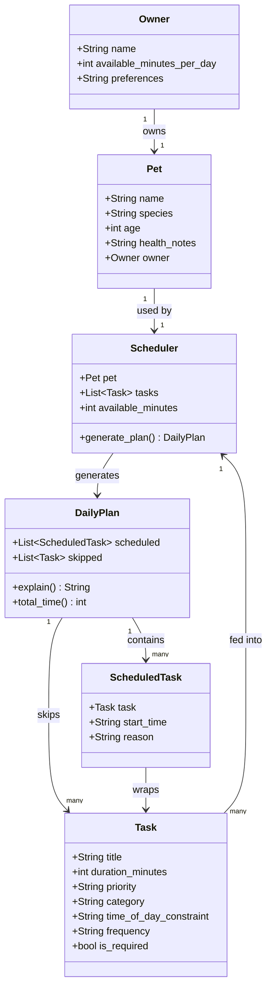

```mermaid
classDiagram
    class Owner {
        +String name
        +int available_minutes_per_day
        +String preferences
    }

    class Pet {
        +String name
        +String species
        +int age
        +String health_notes
        +Owner owner
    }

    class Task {
        +String title
        +int duration_minutes
        +String priority
        +String category
        +String time_of_day_constraint
        +String frequency
        +bool is_required
    }

    class Scheduler {
        +Pet pet
        +List~Task~ tasks
        +int available_minutes
        +generate_plan() DailyPlan
    }

    class DailyPlan {
        +List~ScheduledTask~ scheduled
        +List~Task~ skipped
        +explain() String
        +total_time() int
    }

    class ScheduledTask {
        +Task task
        +String start_time
        +String reason
    }

    Owner "1" --> "1" Pet : owns
    Pet "1" --> "1" Scheduler : used by
    Task "many" --> "1" Scheduler : fed into
    Scheduler --> DailyPlan : generates
    DailyPlan "1" --> "many" ScheduledTask : contains
    DailyPlan "1" --> "many" Task : skips
    ScheduledTask --> Task : wraps
```
