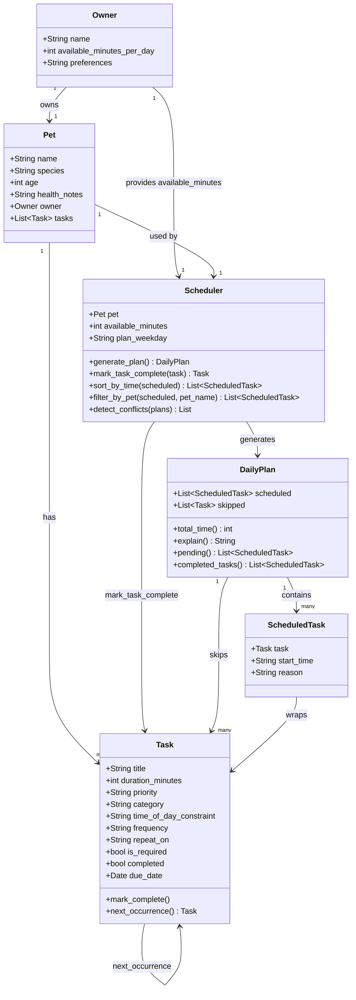

```mermaid
classDiagram
    class Owner {
        +String name
        +int available_minutes_per_day
        +String preferences
    }

    class Pet {
        +String name
        +String species
        +int age
        +String health_notes
        +Owner owner
        +List~Task~ tasks
    }

    class Task {
        +String title
        +int duration_minutes
        +String priority
        +String category
        +String time_of_day_constraint
        +String frequency
        +String repeat_on
        +bool is_required
        +bool completed
        +Date due_date
        +mark_complete()
        +next_occurrence() Task
    }

    class ScheduledTask {
        +Task task
        +String start_time
        +String reason
    }

    class DailyPlan {
        +List~ScheduledTask~ scheduled
        +List~Task~ skipped
        +total_time() int
        +explain() String
        +pending() List~ScheduledTask~
        +completed_tasks() List~ScheduledTask~
    }

    class Scheduler {
        +Pet pet
        +int available_minutes
        +String plan_weekday
        +generate_plan() DailyPlan
        +mark_task_complete(task) Task
        +sort_by_time(scheduled) List~ScheduledTask~
        +filter_by_pet(scheduled, pet_name) List~ScheduledTask~
        +detect_conflicts(plans) List
    }

    Owner "1" --> "1" Pet : owns
    Owner "1" --> "1" Scheduler : provides available_minutes
    Pet "1" --> "1" Scheduler : used by
    Pet "1" --> "many" Task : has
    Scheduler --> DailyPlan : generates
    Scheduler --> Task : mark_task_complete
    Task --> Task : next_occurrence
    DailyPlan "1" --> "many" ScheduledTask : contains
    DailyPlan "1" --> "many" Task : skips
    ScheduledTask --> Task : wraps
```
